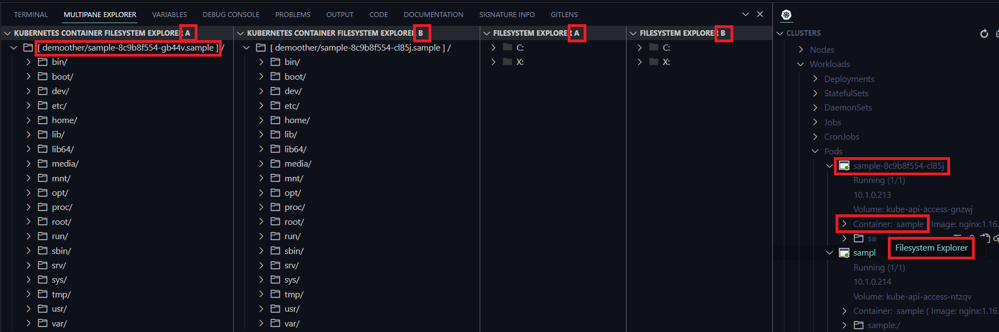

# vscode-multipane-explorer README

A multipane explorer that supports File System, Kubernetes Container (Pod) File System, Zip File System, (S)FTP File System.



## Features

- Show two side by side file explorer views in panel.
- Container node in Clusters view has context menu item ```Filesystem View```.
    - Alternately load in view A and view B (Eventually this will allow copying files/folders from one container to other)
    - Ability to clear the views
- Beginning of Docker Container file explorer

## Requirements


## Extension Settings


## Known Issues

None.

## Release Notes

### 0.0.15

Initial release.
